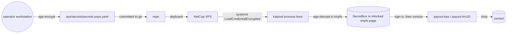

# Treasury Custody Design

Operational design for the pool's treasury private key. The decision
to use a sops/age-encrypted hot key with OS-level isolation (rather
than a remote signer, multi-sig, or hardware-wallet flow) is captured
in [ADR-008](decisions/0008-hot-only-treasury-with-os-isolation.md);
this document describes the implementation.

## 1. Threat targeting

The key protects the wallet that receives mining coinbase rewards and
sends daily KAS + NACHO payouts. Loss-of-access means we can't pay
miners; theft means a one-time drain of whatever is in the hot wallet.

We accept the residual risk that a full VPS compromise drains the hot
wallet. The mitigations below narrow the surface for that compromise
substantially and prevent the more common failure modes
(plaintext-secret-in-repo, key-in-logs, key-in-core-dump, key-in-swap,
key-in-error-message).

## 2. Lifecycle



## 3. Controls

### 3.1 At rest

- File: `ops/secrets/secrets.sops.yaml`
- Encryption: age via sops (`SOPS_AGE_RECIPIENTS` lists the production
  age public key only)
- Git: encrypted file is committed; the age private key is **not**
- Permissions: file mode `0600`, owned by the unprivileged `katpool`
  uid on the VPS
- Backup: a duplicate sops file is stored offline (encrypted USB +
  paper-printed mnemonic in a fireproof safe per
  [`runbooks/11-key-rotation.md`](runbooks/11-key-rotation.md))

### 3.2 In transit (deploy time)

- The encrypted file is never modified on the VPS; it's deployed
  alongside the binary.
- The age private key is **never** stored on the VPS. It lives only
  on the operator's workstation (and offline backups).
- For first-boot key delivery: systemd's `LoadCredentialEncrypted=`
  consumes a **`systemd-creds encrypt`** blob (a different layer from
  sops/age). The operator bridges the two once per deploy — `sops
  --decrypt` the key, `systemd-creds encrypt` it to
  `/etc/katpool/treasury-key.cred`, then `shred` the plaintext — per
  [`runbooks/11-key-rotation.md`](runbooks/11-key-rotation.md). At unit
  start systemd decrypts the `.cred` using a credential-encryption key
  bound to the host's TPM2 (where available) or the system credentials
  secret, and places the plaintext at `$CREDENTIALS_DIRECTORY/treasury-key`,
  in a tmpfs readable only by this service. `katpool-secrets`
  (`load_from_systemd_credential`) reads it there; the plaintext never
  hits disk or an env var.

### 3.3 In memory

- `katpool-secrets` defines `TreasurySecret(SecretBox<[u8; 32]>)`.
  No `Debug` impl. No `Display`. No `Serialize`. No `Clone`.
- `mlock(2)` the page so it cannot be swapped (swap is also disabled
  at OS level — defence in depth).
- On `Drop`, `zeroize` overwrites the bytes; verified by a
  release-only test that uses `gcore` of a running process to dump
  memory and grep for the expected entropy signature (must not be
  present in any region after the key is dropped).

### 3.4 Process isolation (systemd)

The relevant directives in
[`ops/systemd/katpool-hardening.conf`](../ops/systemd/katpool-hardening.conf)
(lands in Phase 4):

```ini
[Service]
# Identity
DynamicUser=no
User=katpool
Group=katpool
SupplementaryGroups=

# Privilege containment
NoNewPrivileges=yes
CapabilityBoundingSet=
AmbientCapabilities=

# Filesystem
ProtectSystem=strict
ProtectHome=yes
PrivateTmp=yes
PrivateDevices=yes
ReadWritePaths=/var/lib/katpool

# Memory
MemoryDenyWriteExecute=yes
LockPersonality=yes
RestrictRealtime=yes
RestrictSUIDSGID=yes

# Network
RestrictAddressFamilies=AF_INET AF_INET6 AF_UNIX
IPAddressDeny=any
IPAddressAllow=localhost
# Public-port ranges are opened via `nft` separately; systemd's
# IPAddressAllow handles outbound-to-Railway only.

# Namespaces
PrivateUsers=yes
ProtectKernelTunables=yes
ProtectKernelModules=yes
ProtectKernelLogs=yes
ProtectClock=yes
ProtectControlGroups=yes
ProtectProc=invisible
ProcSubset=pid

# Syscall surface
SystemCallArchitectures=native
SystemCallFilter=@system-service
SystemCallFilter=~@privileged ~@resources ~@obsolete ~@cpu-emulation
SystemCallErrorNumber=EPERM

# Credentials (systemd-creds blob, produced from the sops plaintext)
LoadCredentialEncrypted=treasury-key:/etc/katpool/treasury-key.cred
```

The full, installable fragment lives at
[`ops/systemd/katpool-hardening.conf`](../ops/systemd/katpool-hardening.conf)
and `katpool-secrets::load_from_systemd_credential` reads the decrypted
key from `$CREDENTIALS_DIRECTORY/treasury-key`.

These directives are tested by the chaos suite in Phase 9 — we
attempt operations from inside the process that should be blocked and
verify that they fail with `EPERM`.

### 3.5 Network

- Inbound: only the stratum TCP ports + nginx on 443. Everything else
  rejected by `nft`.
- Outbound: only DNS + kaspad RPC (loopback) + kasplex + kaspa.org +
  Backblaze B2 + Railway endpoints. Explicitly allowlisted.
- SSH: keys-only, port-knock-then-fail2ban; treasury account is
  `nologin`.

### 3.6 Logging discipline

- `tracing-subscriber` JSON output has a custom layer that scans
  every log event for any value that base64-decodes to 32 bytes;
  drops the event and increments a counter (in tests this should be
  zero).
- Treasury key bytes are never accepted by any logging macro: the
  `TreasurySecret` type is not `Display` or `Debug`.
- Audit log shipped to Loki includes every payout transaction's
  `idempotency_key`, recipient address, amount, and tx hash — but
  not the signed transaction bytes.

### 3.7 Payout policy guards

Before sending any transaction, `payout-kas` and `payout-krc20`
check:

| Guard | Default |
|---|---|
| Max single tx KAS output | 1000 KAS |
| Max per-cycle total KAS outflow | 5000 KAS |
| Max per-recipient KAS outflow per cycle | 100 KAS |
| Max recipients per cycle | 100 |
| Max new-recipient rate (addresses not seen in last 30d) | 10 / cycle |
| NACHO equivalent guards | match the KAS thresholds |

Above any threshold = transaction refused with an alert; payout cycle
continues with eligible recipients only. Operator can override per
cycle via a signed override token in the encrypted secrets file.

## 4. Operational procedures

| Operation | Where | Frequency |
|---|---|---|
| Routine payout | Automated, via `payout-kas` / `payout-krc20` cron | Daily |
| Manual sweep-to-cold | `ops/scripts/sweep_overflow_to_cold.sh` | When hot balance > 14 days of expected payouts |
| Key rotation | [`runbooks/11-key-rotation.md`](runbooks/11-key-rotation.md) | Quarterly drill (rotate to staging key, then back) + ad-hoc on suspected compromise |
| Backup verification | [`runbooks/10-automated-dr-validation.md`](runbooks/10-automated-dr-validation.md) | Weekly, fully automated |
| Sops file integrity check | `sops --decrypt --extract ".[]" file.yaml > /dev/null` | On every deploy |

## 5. What this design does **not** protect against

- Hypervisor-level read of process memory by the cloud provider.
  Mitigation: we use a provider we trust; we cannot fix this in
  software at our scale.
- Operator workstation compromise. Mitigation: the operator
  follows a separate workstation-hardening guide; YubiKey-backed SSH
  and GPG.
- Coerced key disclosure. Out of scope.
- Future quantum break of ECDSA. Out of pool scope; the entire
  Kaspa network shares this risk and will migrate via consensus.

## 6. When to escalate this design

Trigger to revisit and likely upgrade to a remote-signer or
hot/cold-split model:

- Hot wallet routinely holds > 14 days of expected payouts (~50k KAS
  + ~500k NACHO at current rates)
- We observe any attempted unauthorised SSH login that succeeds in
  reaching the unprivileged uid
- A nearby Kaspa pool suffers a treasury compromise via a class of
  attack our controls don't address
- A reasonably-priced and operationally-acceptable hardware-backed
  signing option for Kaspa becomes available
