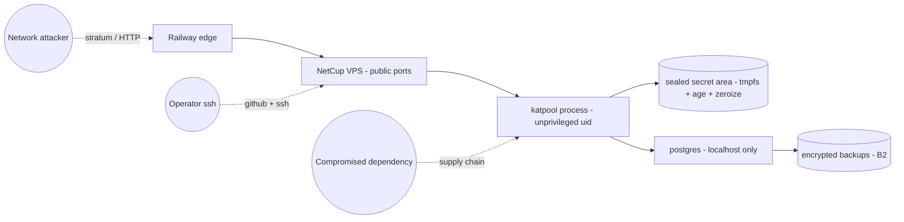

# Threat Model

STRIDE-style threat model for the katpool production system. Every
mitigation listed here corresponds to a concrete control implemented
(or planned) in code or operational configuration. Findings without a
control are open issues to be tracked in GitHub.

This document is reviewed any time we add or remove a trust boundary,
make a custody-related change, or experience a security incident. The
canonical decision for the treasury custody model is
[ADR-008](decisions/0008-hot-only-treasury-with-os-isolation.md).

## 1. Assets

| Asset | Sensitivity | Why it matters |
|---|---|---|
| Treasury private key | **Critical** | Direct theft of pool funds (~30M NACHO + ~25k KAS at time of writing). |
| Miner balance ledger (`miners_balance`) | High | Falsified credits = pool insolvency or unfair payout. |
| Pool fee accrual (`miner_id = 'pool'`) | High | Pool revenue and NACHO-rebate funding source. |
| Stratum credential parity | Medium | Wrong-address routing redirects miner rewards. |
| `idempotency_keys` / `distributed_locks` rows | High | Tamper enables double-pay or skipped pay. |
| Payment / NACHO transaction logs | Medium | Auditability of historical payouts. |
| Observability data | Low–Medium | Can reveal operational patterns; not directly monetizable. |

## 2. Actors

| Actor | Motivation | Capability assumption |
|---|---|---|
| External network attacker | Treasury theft, DoS, share-redirect | Unauthenticated TCP/HTTP access; can flood stratum and APIs |
| Malicious miner | Reward inflation, share withholding, pool hopping | Authenticated stratum connections with a valid Kaspa address |
| Compromised dependency | Supply chain trojan | Can land code that runs at build or runtime |
| Compromised CI runner | Steal release-signing identity, plant backdoored artifacts | Read all GitHub Actions secrets exposed to workflow |
| Compromised operator workstation | Sops/age key extraction | Local FS read; ability to commit/push |
| Hetzner/NetCup insider | Direct host access | Hypervisor-level read; can read disk and memory |
| Railway insider | Read of observability data | Container-level read access |

## 3. Trust boundaries

Each arrow crosses a trust boundary and is the locus for a control
described below.

## 4. STRIDE findings and controls

### 4.1 Spoofing

| Threat | Control | Status |
|---|---|---|
| Miner connects with someone else's wallet | Address must parse as a valid Kaspa bech32 address; rejected immediately if malformed | Phase 1 |
| Attacker impersonates miner to redirect payouts | Stratum address is the payout address; no separate identity. Withholding detector catches grossly anomalous behavior. | Phase 1, Phase 6 |
| Attacker impersonates the pool process to the kaspad | kaspad is in-process (no IPC); no risk | Phase 1 |
| GitHub Action impersonates a release | All workflows pinned by SHA, cosign keyless signing via OIDC, branch protection requires signed commits | Phase 0 milestone 5 |

### 4.2 Tampering

| Threat | Control | Status |
|---|---|---|
| Forged shares (PoW skipped) | Bridge always verifies PoW against the cached job target before crediting | Phase 1 |
| Direct mutation of `miners_balance` | DB access is localhost-only; postgres user has no SUPERUSER; schema enforces non-negative balances via CHECK constraints | Phase 2 |
| Idempotency key replay attack | Keys are deterministic from inputs (block_hash + share_id + recipient); replay = no-op | Phase 4 |
| Storage-mass spoofing | We compute mass ourselves via `katpool-storagemass`; we never trust an externally-supplied mass | Phase 4 |
| KRC-20 envelope tampering | Envelope is constructed locally and immediately submitted; commit/reveal flow signed by treasury key | Phase 5 |
| Deploy-time binary tampering | Cosign keyless signing on every release; deploy script verifies signature before activating | Phase 0 milestone 5 |
| Upstream advisory in a transitive dep | `cargo deny check advisories` blocks RustSec advisories with explicit ignore tracking | Phase 0 milestone 2 |

### 4.3 Repudiation

| Threat | Control | Status |
|---|---|---|
| Operator denies a deploy | All deploys go via PR + signed commits + actions log; nothing deploys outside the workflow | Phase 0 milestone 5 |
| Operator denies a manual SQL change | Postgres logs all DDL/DML to journald → shipped to Loki | Phase 2 |
| Disputed miner payout | All payouts recorded in `payments` / `nacho_payments` with on-chain tx hash; miner can independently verify | Phase 4, 5 |
| Disputed share allocation | `share_windows` keeps a per-share trail with PoW result, accepted timestamp, and credited block | Phase 1, 3 |

### 4.4 Information disclosure

| Threat | Control | Status |
|---|---|---|
| Treasury key bytes in logs | `katpool-secrets::Secret<[u8; 32]>` has no `Debug` impl; logging path never accepts raw bytes; tests scan log output for high-entropy 32-byte hex | Phase 4 |
| Treasury key bytes in core dumps | `mlock` the page; swap disabled at OS level; `MemoryDenyWriteExecute=yes` in systemd unit | Phase 4 |
| Database backup leaks PII | Backups encrypted at rest via pgBackRest; B2 bucket is private with object-lock | Phase 2 |
| Observability stack on Railway sees treasury info | Logs and traces sanitise wallet addresses (last-4 only) where they appear with treasury context; the treasury key itself never crosses the process boundary | Phase 7 |
| Public API leaks per-miner detail to other miners | `/balance/:address` requires the queried address as part of the path — same level of pseudonymity as on-chain | Phase 6 |
| Telegram bot leaks alert detail | Bot only posts to operator-managed chat IDs persisted in DB; chat IDs are admin-only | Phase 7 |

### 4.5 Denial of service

| Threat | Control | Status |
|---|---|---|
| Stratum connection flood | Per-IP connection cap + token-bucket rate limit at the bridge; Railway edge absorbs the bulk of bandwidth attacks | Phase 1, 6 |
| Malformed stratum frames | Parser is fuzz-tested with `cargo-fuzz`; malformed input always returns parse error and disconnects | Phase 1, 6 |
| Slow-loris stratum connections | 30s idle timeout; ASIC miners send work requests frequently enough that idle = bot | Phase 1 |
| Invalid share burst | If invalid-shares/minute > threshold from an IP, ban for 1h via fail2ban | Phase 6 |
| HTTP API DoS | tower-governor rate limit per IP; nginx rate limit; bounded JSON body size | Phase 6 |
| Database resource exhaustion via API queries | All API queries have hard timeouts and are bounded by an in-memory cache | Phase 6 |
| Backup target unreachable | Local WAL accumulates and ships when B2 recovers; alert if archive lag > 1h | Phase 2 |
| External-API (kasplex / kaspa.com) outage | Circuit breaker; cycle skip with explicit alert | Phase 5 |

### 4.6 Elevation of privilege

| Threat | Control | Status |
|---|---|---|
| Unprivileged process gains root on the VPS | `NoNewPrivileges=yes`, `CapabilityBoundingSet=`, `SystemCallFilter` deny `@privileged @resources`, `ProtectSystem=strict`, no setuid binaries reachable | Phase 4 |
| Postgres SUPERUSER takeover from app | App connects with a least-privilege role; SUPERUSER is operator-only, separate role | Phase 2 |
| SSH lateral movement to the treasury account | Treasury account is `nologin`; only `deploy` and `operator` accounts have shells; SSH is keys-only with port-knock-then-fail2ban | Phase 4 |
| Container escape from CI | We do not run our code in third-party CI containers for production deploys; deploy script runs as the constrained `deploy` user on the VPS | Phase 0 milestone 5 |
| Dependency build script reads `/etc` or `~` | Pinned toolchain in a clean container; CI workflow `permissions:` block is read-only by default | Phase 0 milestone 5 |

## 5. Residual risks (accepted)

| Risk | Why accepted | Compensating control |
|---|---|---|
| VPS host compromise → full treasury drain | sops-only custody is the user-chosen trade-off (ADR-008). Hardware-wallet-backed automated signing is not viable on Kaspa today; remote-signer adds complexity that, given current pool size, doesn't yet justify the engineering cost. | OS-level isolation; minimal hot balance considered for Phase 4+ via a manual sweep-to-cold script; quarterly key-rotation drill; offline key backup. |
| GG20-style MPC weakness | We don't use MPC; not applicable. | n/a |
| Quantum break of ECDSA | All Kaspa wallets share this risk; out of pool scope. | n/a |
| Railway provider exit | Self-hosted stack is portable; switching to another VPS provider or to Cloudflare Spectrum is a documented procedure. | Plan-level rollback (we own the artifacts) |
| Operator workstation compromise | We assume the operator's workstation is generally trustworthy; sops age key is on the operator's keyring | YubiKey-backed SSH key + signed commits; operator follows a documented hardening guide |

## 6. Open issues (track as GitHub issues)

- Validate the systemd hardening profile against an actual exploit
  test in Phase 4.
- Decide whether to implement a programmatic max-per-cycle KAS cap or
  rely on the policy-check guard in payout-kas to enforce it.
- Establish a recurring "key rotation drill" calendar reminder
  (covered by the quarterly DR drill — but that targets DB, not the
  treasury key).
- Re-evaluate sops-only vs. remote-signer custody if the hot balance
  routinely exceeds 7 days of expected payouts (currently it doesn't
  by a wide margin).
